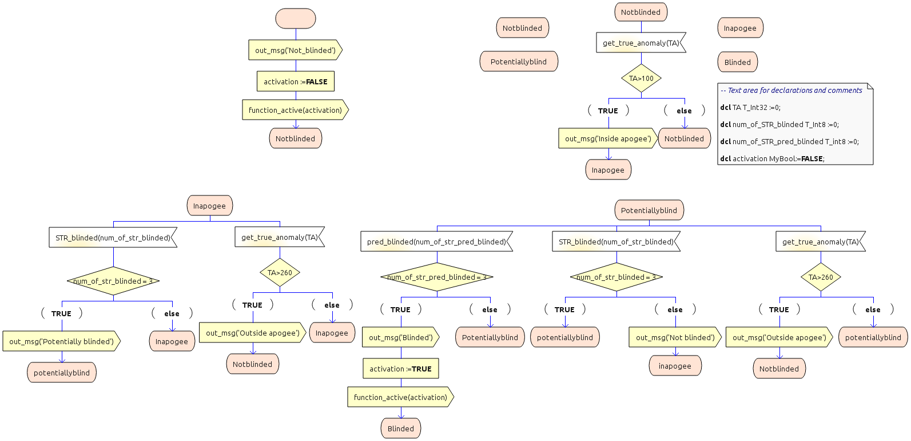

## Star Tracker Blinding Monitor



Example in SDL of the monitoring routine of a star tracker blinding monitor.  SDL Model Copyright (c) 2020 SENER Aeroespacial. 
* [strblindingprotect.bpl](./strblindingprotect.bpl): Boogie translation of the SDL program. Includes verification harness for the input events/signals.
* [strblindingprotect.adb](./strblindingprotect.adb): For reference: ADA code generated from the SDL model.

### Results
The property `(ctxt.state == INAPOGEE) ==> (100 <= ctxt.TA && ctxt.TA <= 260)` was checked by means of an [assert annotation](./strblindingprotect.bpl#L144) in the Boogie program.  It checks whether the state of the monitor correctly tracks whether the satellite is in apogee by evaluating the value of the true anomaly input.

Ultimate finds the following error trace in the Boogie program:

```
[L154]  CALL        call runTransition(0);
        VAL         [id=0]
[L79]               trId := id;
        VAL         [id=0, trId=0]
[L80]   COND TRUE   trId != -1
[L81]   COND TRUE   trId == 0
[L82]   FCALL       call out_msg(MSG_NOT_BLINDED);
[L83]   FCALL       call function_active(false);
[L84]               trId := -1;
[L85]               ctxt.state := NOTBLINDED;
        VAL         [ctxt.num_of_str_blinded=0, ctxt.num_of_str_pred_blinded=0, ctxt.TA=101, id=0, trId=-1]
[L144]              assert ctxt.state == INAPOGEE ==> 100 <= ctxt.TA && ctxt.TA <= 260;
        VAL         [ctxt.num_of_str_blinded=0, ctxt.num_of_str_pred_blinded=0, ctxt.TA=101, id=0, trId=-1]
[L80]   COND FALSE  !(trId != -1)
[L154]  RET         call runTransition(0);
        VAL         [ctxt.num_of_str_blinded=0, ctxt.num_of_str_pred_blinded=0, ctxt.TA=101]
[L157]              havoc _arg;
        VAL         [ctxt.num_of_str_blinded=0, ctxt.num_of_str_pred_blinded=0, ctxt.TA=101]
[L158]  CALL        call get_true_anomaly(_arg);
        VAL         [_ta=261, ctxt.num_of_str_blinded=0, ctxt.num_of_str_pred_blinded=0, ctxt.TA=101, old(ctxt.TA)=101]
[L22]   COND TRUE   ctxt.state == NOTBLINDED
[L23]               ctxt.TA := _ta;
        VAL         [_ta=261, ctxt.num_of_str_blinded=0, ctxt.num_of_str_pred_blinded=0, ctxt.TA=261, old(ctxt.TA)=101]
[L24]   CALL        call runTransition(1);
        VAL         [ctxt.num_of_str_blinded=0, ctxt.num_of_str_pred_blinded=0, ctxt.TA=261, id=1, old(ctxt.TA)=101]
[L79]               trId := id;
        VAL         [ctxt.num_of_str_blinded=0, ctxt.num_of_str_pred_blinded=0, ctxt.TA=261, id=1, old(ctxt.TA)=101, trId=1]
[L80]   COND TRUE   trId != -1
[L81]   COND FALSE  !(trId == 0)
[L86]   COND TRUE   trId == 1
[L87]   COND TRUE   ctxt.TA > 100
[L88]   FCALL       call out_msg(MSG_INSIDE_APOGEE);
[L89]               trId := -1;
[L90]               ctxt.state := INAPOGEE;
        VAL         [ctxt.num_of_str_blinded=0, ctxt.num_of_str_pred_blinded=0, ctxt.TA=261, id=1, old(ctxt.TA)=101, trId=-1]
[L144]              assert ctxt.state == INAPOGEE ==> 100 <= ctxt.TA && ctxt.TA <= 260;
        VAL         [ctxt.num_of_str_blinded=0, ctxt.num_of_str_pred_blinded=0, ctxt.TA=261, id=1, old(ctxt.TA)=101, trId=-1]
```

There is only one incoming event in the error trace:
```
[L158]  CALL        call get_true_anomaly(_arg);
        VAL         [_ta=261, ...]
```

The monitor fails to track the apogee state correctly if the sensor signal for the true anomaly changes value too fast or in an unexpected direction.  In this case, the value of the TA variable changes to 261 in the error trace by a single `get_true_anamoly` event.

### Simulating continuous TA updates

We changed the program to simulate a continuously increasing true
anomoly angle. Instead of choosing the value completely
non-deterministically, we only allow it to increase monotonically by
at most 90 degrees.  It also simulates the wrap-around at 360 degrees.

* [strblindingprotect-ta-sim.bpl](./strblindingprotect-ta-sim.bpl): Boogie translation of the SDL program. It differs from the previous in the implementation of the verification harness.  For the get_true_anomaly input signal, it restricts the value to which the true anomaly value is changed to.


### Results
Again we checked the property `(ctxt.state == INAPOGEE) ==> (100 <= ctxt.TA && ctxt.TA <= 260)`.

Ultimate finds the following error trace in the Boogie program:

```
[L155]  CALL        call runTransition(0);
        VAL         [id=0]
[L79]               trId := id;
        VAL         [id=0, trId=0]
[L80]   COND TRUE   trId != -1
[L81]   COND TRUE   trId == 0
[L82]   FCALL       call out_msg(MSG_NOT_BLINDED);
[L83]   FCALL       call function_active(false);
[L84]               trId := -1;
[L85]               ctxt.state := NOTBLINDED;
        VAL         [ctxt.num_of_str_blinded=0, ctxt.num_of_str_pred_blinded=0, ctxt.TA=101, id=0, trId=-1]
[L144]              assert ctxt.state == INAPOGEE ==> 100 <= ctxt.TA && ctxt.TA <= 260;
        VAL         [ctxt.num_of_str_blinded=0, ctxt.num_of_str_pred_blinded=0, ctxt.TA=101, id=0, trId=-1]
[L80]   COND FALSE  !(trId != -1)
[L155]  RET         call runTransition(0);
        VAL         [ctxt.num_of_str_blinded=0, ctxt.num_of_str_pred_blinded=0, ctxt.TA=101]
[L156]              _ta := 0;
        VAL         [_ta=0, ctxt.num_of_str_blinded=0, ctxt.num_of_str_pred_blinded=0, ctxt.TA=101]
[L159]              havoc _arg;
[L160]              assume _ta <= _arg && _arg <= _ta + 90;
[L161]  COND FALSE  !(_arg >= 360)
        VAL         [_arg=90, _ta=0, ctxt.num_of_str_blinded=0, ctxt.num_of_str_pred_blinded=0, ctxt.TA=101]
[L164]  CALL        call get_true_anomaly(_arg);
        VAL         [_ta=90, ctxt.num_of_str_blinded=0, ctxt.num_of_str_pred_blinded=0, ctxt.TA=101, old(ctxt.TA)=101]
[L22]   COND TRUE   ctxt.state == NOTBLINDED
[L23]               ctxt.TA := _ta;
        VAL         [_ta=90, ctxt.num_of_str_blinded=0, ctxt.num_of_str_pred_blinded=0, ctxt.TA=90, old(ctxt.TA)=101]
[L24]   CALL        call runTransition(1);
        VAL         [ctxt.num_of_str_blinded=0, ctxt.num_of_str_pred_blinded=0, ctxt.TA=90, id=1, old(ctxt.TA)=101]
[L79]               trId := id;
        VAL         [ctxt.num_of_str_blinded=0, ctxt.num_of_str_pred_blinded=0, ctxt.TA=90, id=1, old(ctxt.TA)=101, trId=1]
[L80]   COND TRUE   trId != -1
[L81]   COND FALSE  !(trId == 0)
[L86]   COND TRUE   trId == 1
[L87]   COND FALSE  !(ctxt.TA > 100)
[L92]               trId := -1;
[L93]               ctxt.state := NOTBLINDED;
        VAL         [ctxt.num_of_str_blinded=0, ctxt.num_of_str_pred_blinded=0, ctxt.TA=90, id=1, old(ctxt.TA)=101, trId=-1]
[L144]              assert ctxt.state == INAPOGEE ==> 100 <= ctxt.TA && ctxt.TA <= 260;
        VAL         [ctxt.num_of_str_blinded=0, ctxt.num_of_str_pred_blinded=0, ctxt.TA=90, id=1, old(ctxt.TA)=101, trId=-1]
[L80]   COND FALSE  !(trId != -1)
[L24]   RET         call runTransition(1);
        VAL         [_ta=90, ctxt.num_of_str_blinded=0, ctxt.num_of_str_pred_blinded=0, ctxt.TA=90, old(ctxt.TA)=101]
[L164]  RET         call get_true_anomaly(_arg);
        VAL         [_arg=90, _ta=0, ctxt.num_of_str_blinded=0, ctxt.num_of_str_pred_blinded=0, ctxt.TA=90]
[L165]              _ta := _arg;
        VAL         [_arg=90, _ta=90, ctxt.num_of_str_blinded=0, ctxt.num_of_str_pred_blinded=0, ctxt.TA=90]
[L159]              havoc _arg;
[L160]              assume _ta <= _arg && _arg <= _ta + 90;
[L161]  COND FALSE  !(_arg >= 360)
        VAL         [_arg=179, _ta=90, ctxt.num_of_str_blinded=0, ctxt.num_of_str_pred_blinded=0, ctxt.TA=90]
[L164]  CALL        call get_true_anomaly(_arg);
        VAL         [_ta=179, ctxt.num_of_str_blinded=0, ctxt.num_of_str_pred_blinded=0, ctxt.TA=90, old(ctxt.TA)=90]
[L22]   COND TRUE   ctxt.state == NOTBLINDED
[L23]               ctxt.TA := _ta;
        VAL         [_ta=179, ctxt.num_of_str_blinded=0, ctxt.num_of_str_pred_blinded=0, ctxt.TA=179, old(ctxt.TA)=90]
[L24]   CALL        call runTransition(1);
        VAL         [ctxt.num_of_str_blinded=0, ctxt.num_of_str_pred_blinded=0, ctxt.TA=179, id=1, old(ctxt.TA)=90]
[L79]               trId := id;
        VAL         [ctxt.num_of_str_blinded=0, ctxt.num_of_str_pred_blinded=0, ctxt.TA=179, id=1, old(ctxt.TA)=90, trId=1]
[L80]   COND TRUE   trId != -1
[L81]   COND FALSE  !(trId == 0)
[L86]   COND TRUE   trId == 1
[L87]   COND TRUE   ctxt.TA > 100
[L88]   FCALL       call out_msg(MSG_INSIDE_APOGEE);
[L89]               trId := -1;
[L90]               ctxt.state := INAPOGEE;
        VAL         [ctxt.num_of_str_blinded=0, ctxt.num_of_str_pred_blinded=0, ctxt.TA=179, id=1, old(ctxt.TA)=90, trId=-1]
[L144]              assert ctxt.state == INAPOGEE ==> 100 <= ctxt.TA && ctxt.TA <= 260;
        VAL         [ctxt.num_of_str_blinded=0, ctxt.num_of_str_pred_blinded=0, ctxt.TA=179, id=1, old(ctxt.TA)=90, trId=-1]
[L80]   COND FALSE  !(trId != -1)
[L24]   RET         call runTransition(1);
        VAL         [_ta=179, ctxt.num_of_str_blinded=0, ctxt.num_of_str_pred_blinded=0, ctxt.TA=179, old(ctxt.TA)=90]
[L164]  RET         call get_true_anomaly(_arg);
        VAL         [_arg=179, _ta=90, ctxt.num_of_str_blinded=0, ctxt.num_of_str_pred_blinded=0, ctxt.TA=179]
[L165]              _ta := _arg;
        VAL         [_arg=179, _ta=179, ctxt.num_of_str_blinded=0, ctxt.num_of_str_pred_blinded=0, ctxt.TA=179]
[L159]              havoc _arg;
[L160]              assume _ta <= _arg && _arg <= _ta + 90;
[L161]  COND FALSE  !(_arg >= 360)
        VAL         [_arg=269, _ta=179, ctxt.num_of_str_blinded=0, ctxt.num_of_str_pred_blinded=0, ctxt.TA=179]
[L164]  CALL        call get_true_anomaly(_arg);
        VAL         [_ta=269, ctxt.num_of_str_blinded=0, ctxt.num_of_str_pred_blinded=0, ctxt.TA=179, old(ctxt.TA)=179]
[L22]   COND FALSE  !(ctxt.state == NOTBLINDED)
        VAL         [_ta=269, ctxt.num_of_str_blinded=0, ctxt.num_of_str_pred_blinded=0, ctxt.TA=179, old(ctxt.TA)=179]
[L25]   COND FALSE  !(ctxt.state == POTENTIALLYBLIND)
        VAL         [_ta=269, ctxt.num_of_str_blinded=0, ctxt.num_of_str_pred_blinded=0, ctxt.TA=179, old(ctxt.TA)=179]
[L28]   COND FALSE  !(ctxt.state == BLINDED)
        VAL         [_ta=269, ctxt.num_of_str_blinded=0, ctxt.num_of_str_pred_blinded=0, ctxt.TA=179, old(ctxt.TA)=179]
[L30]   COND TRUE   ctxt.state == INAPOGEE
[L31]               ctxt.TA := _ta;
        VAL         [_ta=269, ctxt.num_of_str_blinded=0, ctxt.num_of_str_pred_blinded=0, ctxt.TA=269, old(ctxt.TA)=179]
[L32]   CALL        call runTransition(6);
        VAL         [ctxt.num_of_str_blinded=0, ctxt.num_of_str_pred_blinded=0, ctxt.TA=269, id=6, old(ctxt.TA)=179]
[L79]               trId := id;
        VAL         [ctxt.num_of_str_blinded=0, ctxt.num_of_str_pred_blinded=0, ctxt.TA=269, id=6, old(ctxt.TA)=179, trId=6]
[L80]   COND TRUE   trId != -1
[L81]   COND FALSE  !(trId == 0)
[L86]   COND FALSE  !(trId == 1)
[L95]   COND FALSE  !(trId == 2)
[L105]  COND FALSE  !(trId == 3)
[L114]  COND FALSE  !(trId == 4)
[L123]  COND FALSE  !(trId == 5)
[L132]  COND TRUE   trId == 6
[L133]  COND TRUE   ctxt.TA > 260
[L134]  FCALL       call out_msg(MSG_OUTSIDE_APOGEE);
[L135]              trId := -1;
[L136]              ctxt.state := NOTBLINDED;
        VAL         [ctxt.num_of_str_blinded=0, ctxt.num_of_str_pred_blinded=0, ctxt.TA=269, id=6, old(ctxt.TA)=179, trId=-1]
[L144]              assert ctxt.state == INAPOGEE ==> 100 <= ctxt.TA && ctxt.TA <= 260;
        VAL         [ctxt.num_of_str_blinded=0, ctxt.num_of_str_pred_blinded=0, ctxt.TA=269, id=6, old(ctxt.TA)=179, trId=-1]
[L80]   COND FALSE  !(trId != -1)
[L32]   RET         call runTransition(6);
        VAL         [_ta=269, ctxt.num_of_str_blinded=0, ctxt.num_of_str_pred_blinded=0, ctxt.TA=269, old(ctxt.TA)=179]
[L164]  RET         call get_true_anomaly(_arg);
        VAL         [_arg=269, _ta=179, ctxt.num_of_str_blinded=0, ctxt.num_of_str_pred_blinded=0, ctxt.TA=269]
[L165]              _ta := _arg;
        VAL         [_arg=269, _ta=269, ctxt.num_of_str_blinded=0, ctxt.num_of_str_pred_blinded=0, ctxt.TA=269]
[L159]              havoc _arg;
[L160]              assume _ta <= _arg && _arg <= _ta + 90;
[L161]  COND FALSE  !(_arg >= 360)
        VAL         [_arg=359, _ta=269, ctxt.num_of_str_blinded=0, ctxt.num_of_str_pred_blinded=0, ctxt.TA=269]
[L164]  CALL        call get_true_anomaly(_arg);
        VAL         [_ta=359, ctxt.num_of_str_blinded=0, ctxt.num_of_str_pred_blinded=0, ctxt.TA=269, old(ctxt.TA)=269]
[L22]   COND TRUE   ctxt.state == NOTBLINDED
[L23]               ctxt.TA := _ta;
        VAL         [_ta=359, ctxt.num_of_str_blinded=0, ctxt.num_of_str_pred_blinded=0, ctxt.TA=359, old(ctxt.TA)=269]
[L24]   CALL        call runTransition(1);
        VAL         [ctxt.num_of_str_blinded=0, ctxt.num_of_str_pred_blinded=0, ctxt.TA=359, id=1, old(ctxt.TA)=269]
[L79]               trId := id;
        VAL         [ctxt.num_of_str_blinded=0, ctxt.num_of_str_pred_blinded=0, ctxt.TA=359, id=1, old(ctxt.TA)=269, trId=1]
[L80]   COND TRUE   trId != -1
[L81]   COND FALSE  !(trId == 0)
[L86]   COND TRUE   trId == 1
[L87]   COND TRUE   ctxt.TA > 100
[L88]   FCALL       call out_msg(MSG_INSIDE_APOGEE);
[L89]               trId := -1;
[L90]               ctxt.state := INAPOGEE;
        VAL         [ctxt.num_of_str_blinded=0, ctxt.num_of_str_pred_blinded=0, ctxt.TA=359, id=1, old(ctxt.TA)=269, trId=-1]
[L144]              assert ctxt.state == INAPOGEE ==> 100 <= ctxt.TA && ctxt.TA <= 260;
        VAL         [ctxt.num_of_str_blinded=0, ctxt.num_of_str_pred_blinded=0, ctxt.TA=359, id=1, old(ctxt.TA)=269, trId=-1]
```

The error is triggered after several events:

```
[L85]               ctxt.state := NOTBLINDED;
        ...
[L164]  CALL        call get_true_anomaly(_arg);
        VAL         [_ta=90, ...]
        ...
[L93]               ctxt.state := NOTBLINDED;
        ...
[L164]  CALL        call get_true_anomaly(_arg);
        VAL         [_ta=179, ...]
[L90]               ctxt.state := INAPOGEE;
        ...
[L164]  CALL        call get_true_anomaly(_arg);
        VAL         [_ta=269, ...]
        ...
[L136]              ctxt.state := NOTBLINDED;
        ...
[L164]  CALL        call get_true_anomaly(_arg);
        VAL         [_ta=359, ...]
        ...
[L90]               ctxt.state := INAPOGEE;
```


In this case it exhibits a real bug in the SDL model that switches repeatedly between INAPOGEE and NOT_BLINDED when the angle is greater than 260 degrees.
